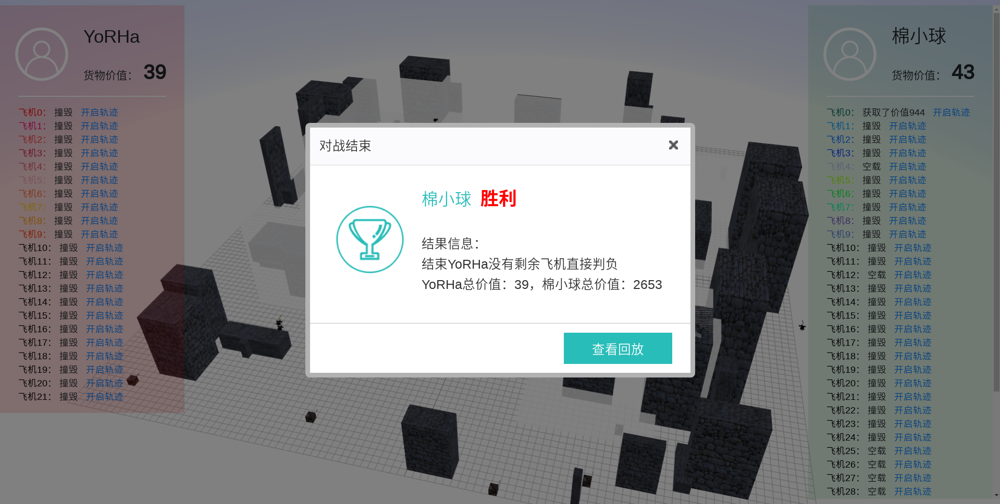

#### 1、赛题
复赛题目

背景介绍

海康机器人行业级无人机业务依托海康威视视频技术的积累，进行跨技术领域的深度整合，以视频图像处理为核心、以产品安全为基石、以智能应用为导向、以满足行业需求为目标，自主研发了雄鹰系列无人机及保障低空空域安全的无人机干扰器，以丰富的产品为客户提供有针对性的行业解决方案，立足安防，专注行业。题目以无人机为主题，考察参赛队伍的综合能力。这个夏天，来一起AI对战吧！

复赛无人机说明

由于目前技术的限制，无人机的飞行过程中耗电量极大。为了方便做题，现在假设无人机空载的时候，耗电量极低，可以忽略不计。载货时，耗电量跟货物的重量成正比，比例系数为1，例如货物重量为100，那么单位时间的耗电量为100个单位电能。单位时间耗电量跟无人机有没有移动无关，即静止状态也需要耗能，包括无人机在地面的时候（停机坪除外）。不同的无人机电池容量不同。如果无人机在外面飞行过程中出现没电量（空载除外），即视为无人机坠毁（不论是否在地面）。选手可以在自己的停机坪对无人机进行充电，单位时间充的电量跟无人机机型有关。（无人机只能在空载的时候进行充电，如果载有货物，不能进行充电，否则视为犯规）。停机坪可以同时对多架无人机进行充电（充满电后，可以停留在停机坪）。初始无人机电量都为0，（包括比赛开始时，以及新购买的无人机），因此一开始需要充电（不打算运送货物除外）。

#### 2、实战录像

